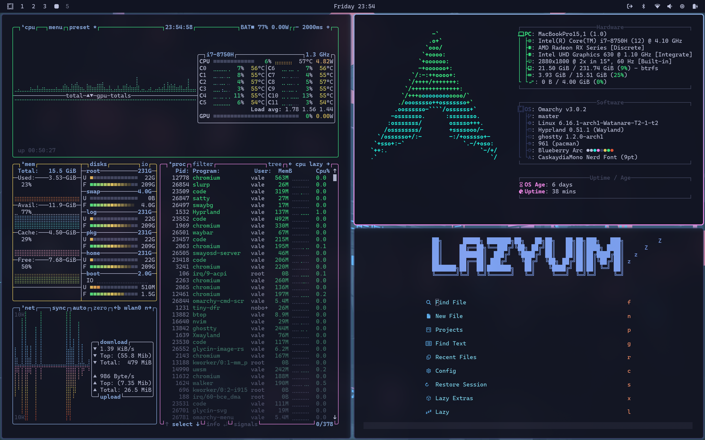

# Arc Blueberry Theme for Omarchy

A dark & vibrant theme inspired by the Arc Blueberry variant from the [BeardedTheme VSCode extension](https://marketplace.visualstudio.com/items?itemName=BeardedBear.beardedtheme), with extra customizations for seamless Omarchy integration. 

Features blue-toned palettes with subtle pink-to-blue gradients on borders, enhanced Chromium theming, and automatic VSCode setup for a cohesive, immersive desktop experience.


*Screenshot: Hyprland with custom borders, Waybar, Ghostty terminal, and Neovim in action.*

## Key Colors
| Element | Color     |
|---------|-----------|
| Background | #111422 |
| Foreground | #bcc1dc |
| Accent (Blue) | #8eb0e6 |
| Success (Green) | #3CEC85 |
| Warning (Yellow) | #EACD61 |
| Error (Red) | #E35535 |
| Custom Border Gradient | #F38CEC to #8eb0e6 |

## Features
- **Full Omarchy Support**: Hyprland (custom gradients, animations), Waybar, Wofi, Ghostty, Alacritty, Btop (detailed gradients), Mako, Neovim, Hyprlock, SwayOSD, Walker, icons (Yaru-dark).
- **Browser Tweaks**: Simplified `chromium.theme` for moody blue NTP/tabs.
- **VSCode Auto-Setup**: `vscode.json` installs BeardedTheme and sets Arc Blueberry as default.
- **Extra Customizations**: Vibrant pink-to-blue borders, smooth focus animations, and cyberpunk-inspired wallpapers.

## Installation

Run the following command to install directly from GitHub:
```
omarchy-theme-install https://github.com/vale-c/omarchy-arc-blueberry
```

This will automatically place the theme in your Omarchy themes directory.

## Customization
Edit files directly (e.g., `hyprland.conf` for border tweaks, `chromium.theme` for browser seeds), then reselect in Omarchy to apply. For VSCode, the `vscode.json` handles extension/theme sync automatically.

## Credits
- **Inspiration**: [BeardedTheme Arc Blueberry](https://marketplace.visualstudio.com/items?itemName=BeardedBear.beardedtheme) (original VSCode colors and palette).
- **Customizations**: Tailored borders, Chromium seeds, and VSCode integration for Omarchy.

## License
MIT. Fork, customize, and share freely!

---

⭐ Star the repo if you enjoy it! Questions? Open an issue on GitHub.