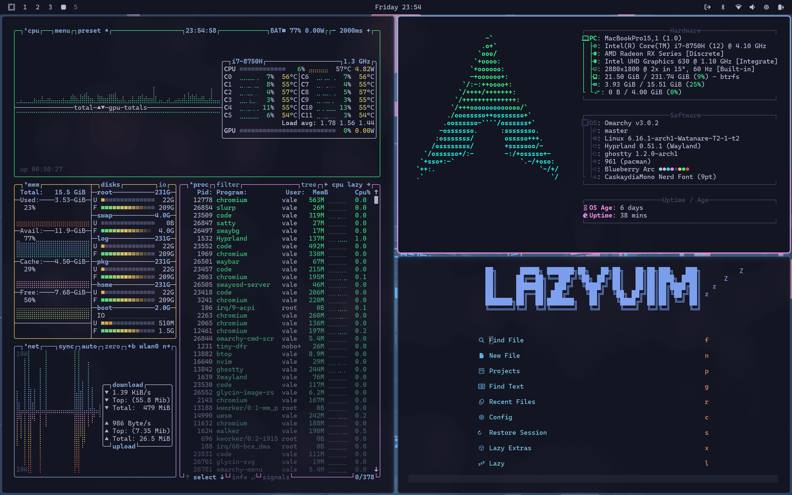

# Arc Blueberry for Omarchy

Midnight navy, electric blueberry, and a magenta-to-blue window glow. Arc Blueberry gives Omarchy a vivid, coherent cyberpunk edge while keeping text crisp and the desktop comfortable for everyday work.



## Why it stands out

- A luminous pink-to-blue active border with a soft blue window glow
- One balanced palette across the Omarchy shell, terminals, editors, btop, browser chrome, lock screen, and more
- Four matching wallpapers and Yaru Blue icons
- Native support for the Omarchy 4 theme system
- The original Bearded Theme Arc Blueberry experience in VS Code

## Install

Open the Omarchy Menu with `Super + Space`, then choose **Install > Style > Theme** and paste:

```text
https://github.com/vale-c/omarchy-arc-blueberry
```

Or install it from a terminal:

```bash
omarchy theme install https://github.com/vale-c/omarchy-arc-blueberry
```

The theme is applied immediately. To return to it later, use **Style > Theme** or press `Super + Ctrl + Shift + Space`.

Already installed an older version? Update all third-party themes, then select Arc Blueberry again:

```bash
omarchy theme update
```

## What gets themed

Arc Blueberry uses Omarchy's semantic `colors.toml` palette. Omarchy generates and reloads its supported integrations whenever the theme is selected, so they stay consistent without a directory full of duplicated config files.

| Surface | Included integrations |
|---|---|
| Omarchy shell | Top bar, menus, launcher, notifications, OSD, authentication prompts, image picker, and lock screen |
| Hyprland | Gradient borders, rounded corners, compact gaps, blur, fluid animations, and an active-window glow |
| Terminals | Ghostty, Alacritty, Kitty, Foot, and tmux |
| Editors | Neovim, Helix, Obsidian, VS Code, VSCodium, and Cursor |
| AI and CLI tools | Claude Code, Pi, OpenCode, Gum, and btop |
| Browsers | Chromium, Chrome, Edge, Brave, and Brave Origin |
| Desktop | GNOME light/dark preference, supported keyboard RGB, four wallpapers, and Yaru Blue icons |

VS Code, VSCodium, and Cursor intentionally use the original **Bearded Theme Arc Blueberry** extension. The other integrations are generated directly from this repository's palette by Omarchy 4.

## Palette

| Role | Hex | Preview |
|---|---|---|
| Background | `#111422` |  |
| Selection | `#313b62` |  |
| Foreground | `#bcc1dc` |  |
| Accent | `#8eb0e6` |  |
| Electric blue | `#69c3ff` |  |
| Magenta | `#f38cec` |  |
| Cyan | `#22ecdb` |  |
| Green | `#3cec85` |  |
| Yellow | `#eacd61` |  |
| Red | `#e35535` |  |
| Active border | `#f38cec` to `#8eb0e6` |   |

## Customize

Installed themes live in `~/.config/omarchy/themes/`. The two files that define Arc Blueberry are:

- `colors.toml`, the shared palette used by Omarchy's generated integrations
- `hyprland.lua`, the gradient border, glow, gaps, rounding, blur, and motion layer

After making a change, select the theme again to regenerate and reload its integrations. Local edits can conflict with a later `omarchy theme update`, so keep a copy if you plan to maintain a personal variant.

### If the glow is missing after an update

Updating a theme pulls its files but does not reapply them. Run:

```bash
omarchy theme update
omarchy theme set arc-blueberry
```

The second command loads `hyprland.lua`, which enables the blue shadow around the active window. No personal Hyprland override should be required.

## Credits

The palette and VS Code integration are based on [Bearded Theme Arc Blueberry](https://marketplace.visualstudio.com/items?itemName=BeardedBear.beardedtheme) by BeardedBear. The Omarchy integration, Hyprland treatment, and wallpapers are original.

Released under the [MIT License](LICENSE).
